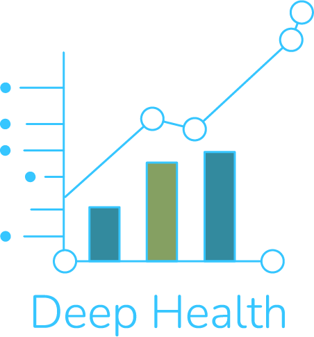

# Deep Health - Plataforma de Análisis de Datos Médicos

**Deep Health** es una aplicación desktop diseñada para profesionales de la salud, facilitando la gestión, análisis y visualización de datos médicos. Desarrollada con Python y PyQt6, integra herramientas avanzadas para el procesamiento de datos clínicos, ofreciendo una interfaz intuitiva y funcionalidades especializadas.

---

## Características Principales

### 🔐 Autenticación Segura
- Registro e inicio de sesión de usuarios con almacenamiento en archivo Excel.
- Protección contra intentos fallidos (máximo 3 intentos).

### 📊 Gestión de Datos
- **Carga de datos**: Soporte para archivos Excel (.xlsx, .xls) y CSV.
- **Edición flexible**: Añadir, modificar o eliminar registros médicos.
- **Búsqueda y reemplazo**: Herramienta para localizar y actualizar datos en masa.
- **Exportación**: Guardar resultados en formato Excel o CSV.

### 🩺 Análisis Automático
- **Datos demográficos**: Distribución por género, rango de edades y estadísticas básicas.
- **Signos vitales**: Interpretación automática de:
  - Saturación de oxígeno.
  - Presión arterial (clasificación por etapas).
  - Frecuencia cardíaca (pulso).
  - Temperatura corporal (detección de fiebre).
  - Índice de Masa Corporal (IMC) con categorización.

### 📈 Visualización Avanzada
- Gráficos personalizados:
  - Presión arterial (sistólica vs. diastólica).
  - Histogramas y boxplots para IMC, temperatura y pulso.
  - Líneas de referencia médicas integradas (ej. SpO2 < 95% como anormal).
- Personalización de ejes y tipos de gráficos (líneas, barras, dispersión).

### 🛠️ Tecnologías Utilizadas
- **Lenguaje**: Python 3
- **Interfaz gráfica**: PyQt6
- **Análisis de datos**: Pandas, NumPy
- **Visualización**: Matplotlib, Seaborn
- **Estilos**: CSS personalizado para interfaz moderna.

---
